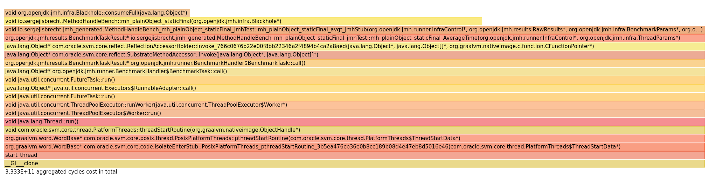

# StackTrace

## Setup

Set the GraalVM JDK17 path in `gradle.properties`

```
org.gradle.java.installations.paths=/home/user/graalvm-community-java17-linux-amd64-dev/graalvm-community-openjdk-17.0.7+4.1
```

When using a different JDK version, you might need to change the `build.gradle.kts` file

```
languageVersion.set(JavaLanguageVersion.of(17))
```

to a version of your liking.

If nothing is set, an error will be shown

```
* What went wrong:
Execution failed for task ':compileJava'.
> Error while evaluating property 'javaCompiler' of task ':compileJava'.
   > Failed to calculate the value of task ':compileJava' property 'javaCompiler'.
      > No matching toolchains found for requested specification: {languageVersion=17, vendor=any, implementation=vendor-specific}.
         > No locally installed toolchains match (see https://docs.gradle.org/8.0/userguide/toolchains.html#sec:auto_detection) and toolchain auto-provisioning is not enabled (see https://docs.gradle.org/8.0/userguide/toolchains.html#sec:auto_detection).
```

## Run 

### OpenJDK

Will run with JDK provided in `gradle.properties`

```
./gradlew run --no-daemon --rerun-tasks
```

### native-image

```
./gradlew nativeCompile --no-daemon --rerun-tasks --info
```

and 

```
./build/native/nativeCompile/bench_amd64
```

## Result

Run on amd64 (5.4.0-146-generic)

### OpenJDK 17 Temurin hotspot C2

```
openjdk version "17.0.6" 2023-01-17
OpenJDK Runtime Environment Temurin-17.0.6+10 (build 17.0.6+10)
OpenJDK 64-Bit Server VM Temurin-17.0.6+10 (build 17.0.6+10, mixed mode, sharing)
```

```
Benchmark                                                             Mode  Cnt   Score    Error   Units
MethodHandleBench.baseline                                            avgt    5   0.502 ±  0.018   ns/op
MethodHandleBench.baseline:·gc.alloc.rate                             avgt    5  ≈ 10⁻⁴           MB/sec
MethodHandleBench.baseline:·gc.alloc.rate.norm                        avgt    5  ≈ 10⁻⁸             B/op
MethodHandleBench.baseline:·gc.count                                  avgt    5     ≈ 0           counts
-
MethodHandleBench.methodHandleStaticFinal                             avgt    5   3.541 ±  0.560   ns/op
MethodHandleBench.methodHandleStaticFinal:·gc.alloc.rate              avgt    5  ≈ 10⁻⁴           MB/sec
MethodHandleBench.methodHandleStaticFinal:·gc.alloc.rate.norm         avgt    5  ≈ 10⁻⁷             B/op
MethodHandleBench.methodHandleStaticFinal:·gc.count                   avgt    5     ≈ 0           counts
-
MethodHandleBench.mh_plainObject_staticFinal                          avgt    5   0.740 ±  0.016   ns/op // <-
MethodHandleBench.mh_plainObject_staticFinal:·gc.alloc.rate           avgt    5  ≈ 10⁻⁴           MB/sec
MethodHandleBench.mh_plainObject_staticFinal:·gc.alloc.rate.norm      avgt    5  ≈ 10⁻⁷             B/op
MethodHandleBench.mh_plainObject_staticFinal:·gc.count                avgt    5     ≈ 0           counts
-
MethodHandleBench.mh_staticPlainLong_staticFinal                      avgt    5   3.603 ±  0.412   ns/op // <-
MethodHandleBench.mh_staticPlainLong_staticFinal:·gc.alloc.rate       avgt    5  ≈ 10⁻⁴           MB/sec
MethodHandleBench.mh_staticPlainLong_staticFinal:·gc.alloc.rate.norm  avgt    5  ≈ 10⁻⁷             B/op
MethodHandleBench.mh_staticPlainLong_staticFinal:·gc.count            avgt    5     ≈ 0           counts

```
[async-profiler methodHandleStaticFinal](./doc/openjdk_flame-cpu-forward.html)

### native-image JDK17

```
GraalVM CE 23.1.0-dev-20230414_0206
https://github.com/graalvm/graalvm-ce-dev-builds/releases/tag/23.1.0-dev-20230414_0206
graalvm-community-java17-linux-amd64-dev.tar.gz
```

```
Benchmark                                                        Mode  Cnt    Score   Error   Units
MethodHandleBench.baseline                                       avgt    5    1.077 ± 0.027   ns/op
MethodHandleBench.baseline:·gc.alloc.rate                        avgt    5      ≈ 0          MB/sec
MethodHandleBench.baseline:·gc.count                             avgt    5      ≈ 0          counts
-
MethodHandleBench.methodHandleStaticFinal                        avgt    5  429.505 ± 7.226   ns/op
MethodHandleBench.methodHandleStaticFinal:·gc.alloc.rate         avgt    5      ≈ 0          MB/sec
MethodHandleBench.methodHandleStaticFinal:·gc.count              avgt    5  129.000          counts
MethodHandleBench.methodHandleStaticFinal:·gc.time               avgt    5  256.000              ms
-
MethodHandleBench.mh_plainObject_staticFinal                     avgt    5    3.649 ± 0.018   ns/op // <-
MethodHandleBench.mh_plainObject_staticFinal:·gc.alloc.rate      avgt    5      ≈ 0          MB/sec
MethodHandleBench.mh_plainObject_staticFinal:·gc.count           avgt    5      ≈ 0          counts
-
MethodHandleBench.mh_staticPlainLong_staticFinal                 avgt    5  406.263 ± 3.008   ns/op
MethodHandleBench.mh_staticPlainLong_staticFinal:·gc.alloc.rate  avgt    5      ≈ 0          MB/sec
MethodHandleBench.mh_staticPlainLong_staticFinal:·gc.count       avgt    5  111.000          counts
MethodHandleBench.mh_staticPlainLong_staticFinal:·gc.time        avgt    5  224.000              ms
```


(flamegraph methodHandleStaticFinal)


(flamegraph plainObject_staticFinal)

